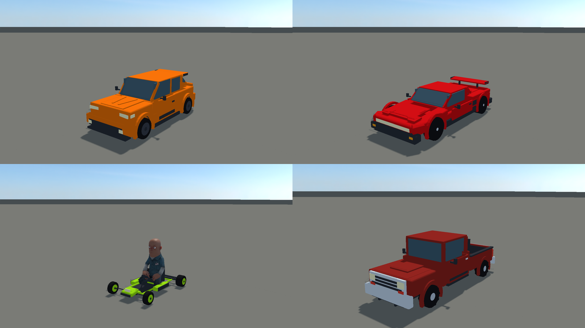
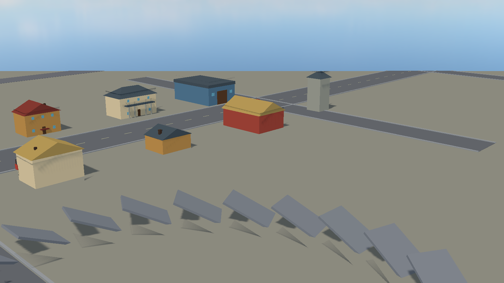

# Vehicle Prototyping

A free, clonable **baseline for building driving games in [s&box](https://sbox.game)** - part of
the s&box Field Kit family of prototyping tools. Clone it, open it in the editor, and you have a
tuned vehicle physics stack, a proving-ground test world, four distinct cars, and a data-driven
playtest harness ready to build on.

This is a developer starting point, not a finished game. It is meant to be forked.

---

## What you get

- **A tuned, slip-curve vehicle physics stack** - raycast-wheel suspension along the contact
  normal, a slip-ratio / slip-angle tire model with parametric peaked curves, a friction ellipse,
  load sensitivity, 4x substepping (200 Hz effective on a 50 Hz tick), a drivetrain with a torque
  curve and auto-shifting, and ABS / traction / stability assists at three levels
  (Casual / Sport / Sim). All in SI units, converted only at the engine boundary.
- **Four cars, four feels** - a front-drive hatch, a rear-drive coupe, a light kart, and a heavier
  pickup, each tuned toward its own class targets and drivable out of the box.
- **A proving-ground world** - an instrumented test track (skidpad, drag strip, brake zone,
  slalom, ramps, banked curve, washboard, hill grades, J-turn pad) plus a looser playground world,
  switchable live in-game.
- **A data-driven playtest harness** - a Python runner drives the live editor through a battery of
  scripted maneuvers, measures telemetry, and prints pass/fail against per-class metric bands, so
  "feels right" becomes a number you can check.

- **A multi-part vehicle pipeline** - a Blender generator authors each vehicle from separate parts
  (chassis, wheels, doors, bumpers) with joints at their pivots, so wheels compress and steer from
  the real simulation - the foundation for parts interaction and, later, damage.

---

## Quick start

1. Clone the repo.
2. Open `vehicle_prototyping.sbproj` in the s&box editor and let it compile.
3. Press **Play** and drive with `W` `A` `S` `D`.

Press `I` for controls, `Tab` (or `[` / `]`) to change car, `M` to change world, `T` for the
live tuning panel, and `L` for the telemetry overlay.

**Full walkthrough: [`docs/GETTING-STARTED.md`](docs/GETTING-STARTED.md)** - controls, car and
world switching, the tuning panel, running the test battery, and a tour of the code.

---

## Controls at a glance

| Key | Action | | Key | Action |
|---|---|---|---|---|
| `W` / `S` | Throttle / brake | | `Tab` | Session menu (change car) |
| `A` / `D` | Steer | | `[` / `]` | Cycle to previous / next car |
| `Space` | Handbrake | | `M` | World & terrain panel |
| `R` | Reset / unflip car | | `T` | Live tuning panel |
| `G` | Auto / manual gearbox | | `L` | Telemetry overlay |
| `E` / `Q` | Shift up / down (manual) | | `I` | Help overlay |
| `Mouse` | Orbit camera · wheel zoom | | `H` | Hide / show HUD |

Gamepad: left stick steers, triggers are throttle / brake, `A` is the handbrake, `R1` / `L1`
shift in manual, `D-pad up` toggles the gearbox, `X` resets. Full table in
`docs/GETTING-STARTED.md`.

---

## How mature is it?

See **[`docs/feature-matrix.md`](docs/feature-matrix.md)** for an honest, per-feature ledger of
what is built, what is partial, and what is out of scope. The short version: the physics stack,
the four cars, the proving grounds, and the test harness are all live and working; a few
maneuver-band edge cases are documented reds (see the feature matrix and `docs/baseline-metrics.md`)
rather than hidden.

**Explicit non-goals:** full soft-body (node-beam) simulation, traffic AI, and open-world
streaming are out of scope. The multi-body track goes as far as multi-part vehicles with joints
and detach-on-impact.

---

## Documentation

| Doc | What it covers |
|---|---|
| `docs/GETTING-STARTED.md` | Clone -> open -> drive, plus everything below in walkthrough form. |
| `docs/tuning-guide.md` | What every tuning dial does, in plain language (no car expertise needed). |
| `docs/feature-matrix.md` | Honest what-works ledger. |
| `docs/handling-targets.md` | Per-class metric target bands. |
| `docs/baseline-metrics.md` | Measured results for the shipped roster. |
| `docs/proving-grounds.md` | Test-track station layout. |
| `docs/testing-harness.md` | The playtest harness recipe and telemetry contract. |
| `docs/part-kit-pipeline.md` / `docs/part-kit-assembly.md` | The Blender multi-part vehicle pipeline. |
| `docs/pickup-kit.md` | The pickup-truck part kit. |

---

## License

MIT licensed - see [`LICENSE`](LICENSE). Clone it, fork it, ship it.

---

## Requirements

- [s&box](https://sbox.game) (the editor - it references your Steam s&box install directly).
- Python 3 for the optional test harness (`tools/vp_test.py`, standard library only).
- Blender 5.1 only if you want to regenerate vehicle part kits (`tools/gen_vehicle.py`).

---

## Community

Building a driving game on this baseline, or tuning your own vehicle physics? Join the
s&box Field Guide Discord — share your project, swap tuning notes, and get help with
the traps: **[discord.gg/JfrwFtn9T](https://discord.gg/JfrwFtn9T)**
